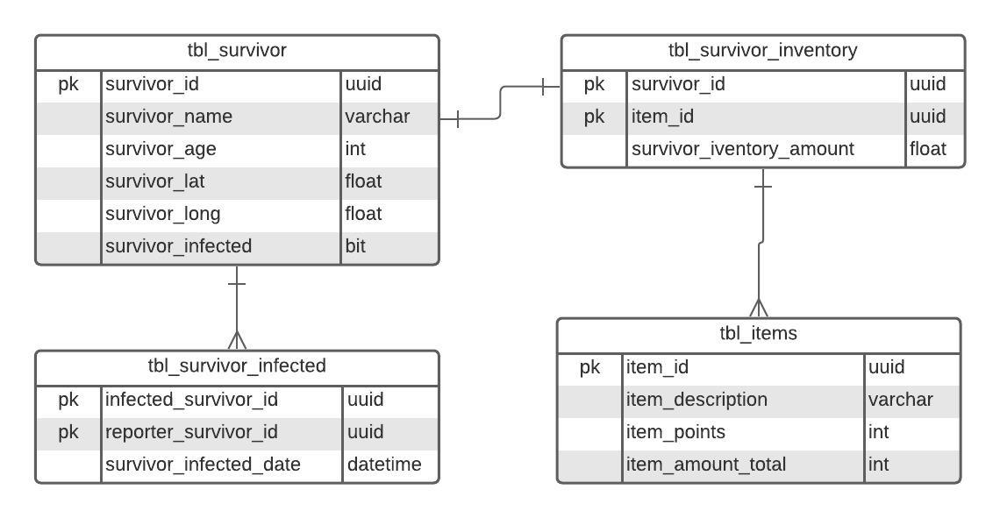

# TRZ (The Resident Zombie) - Backend

## Problem Description

The world, as we know it, has fallen into an apocalyptic scenario. The "Influenzer T-Virus" (a.k.a. Twiter Virus) is transforming human beings into stupid beasts (a.k.a. Zombies), hungry to cancel humans and eat their limbs.

You, the last survivor who knows how to code, will help the resistance by deploying a system to connect the remaining humans. This system will be essential to detect new infections and share resources between the members.

## Requirements

- ***RESTful API***

- **Add survivors to the database**

- **Update survivor location**

- **Flag survivor as infected**

- **Survivors cannot Add/Remove items from inventory**

- **Trade items**

## Database structure



## how can run this app

### Tools

- **Docker with docker-compose**

- **NodeJS LTS**

### Instructions

**Run Tests**

- at the root of the project, run the command

```shell
   npx jest
```

test coverage can be found at:
```
.
+-- src
|   +-- __tests__
|       +-- coverage
|            +-- lcov-report
|                + index.html
```

**Run  application**

you need to configure the database credentials:

.production-ormconfig.json contains the settings for production. the same settings shown in the docker-compose.yml file:

**production-ormconfig.json**
```json
[
    {
        "name": "default",
        "type" : "postgres",
        "host": "postgresDB",
        "port": 5432,
        "username": "postgres",
        "password": "123456",
        "database": "trz_database",
        "entities": [
          "./dist/usecases/typeorm/entities/*.js"
        ],
        "migrations": [
          "./dist/usecases/typeorm/migrations/*.js"
        ],
        "cli": {
          "migrationsDir":  "./src/usecases/typeorm/migrations"
        }
    }
]

```
**docker-compose**
```yml
  postgresDB:
    image: postgres:alpine
    container_name: trz_database
    environment:
      - POSTGRES_PASSWORD=123456
      - POSTGRES_DB=trz_database
    ports:
      - "15432:5432"
    volumes:
      - db_data:/var/lib/postgresql/data
    networks:
      - trz-network
    restart: always
```

**IMPORTANT**

- if necessary, change the credentials of the fields, but do not change the file name, as there is a script in the **package.json** will automatically replace the files

**Run Docker**
- at the root of the project, run the command

```shell
   docker-compose up -d
```

## API Documentation

after starting the server, the documentation api can be found in **/api-docs/**

example:
    http://localhost:3333/api-docs/
